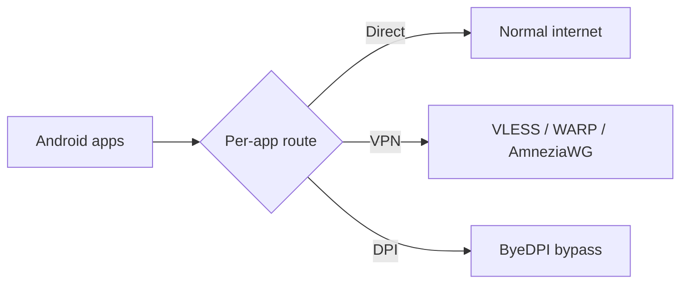

<div align="center">

# Detour

### Route every Android app your way.

**Direct when you want it. VPN when you need it. DPI bypass when nothing else works.**

Detour is an open-source Android network client built around one simple idea: **different apps should be able to use different routes**. Choose `Direct`, `VPN`, or `DPI` per app, then let Detour manage the Android VPN tunnel, DNS policy, profiles, subscriptions, and routing state.

[**Download latest release**](https://github.com/arttvad9r/detour/releases/latest) · [Getting started](docs/getting-started.md) · [Full feature guide](docs/features.md) · [Privacy](PRIVACY.md)

[](https://github.com/arttvad9r/detour/releases/latest)
[](https://github.com/arttvad9r/detour/actions/workflows/android.yml)
[](https://github.com/arttvad9r/detour/releases/latest)
[](LICENSE)

</div>

> [!IMPORTANT]
> Detour is pre-release software. Review the current limitations and verify every configuration you import before relying on it for sensitive traffic. GitHub release APKs currently target `arm64-v8a` devices.

## Why Detour?

A traditional VPN usually gives you one global choice: everything goes through the tunnel, or nothing does. Detour makes routing explicit **per application**.



That means you can keep latency-sensitive or local apps on the normal connection, send selected apps through your VPN profile, and route another set through ByeDPI — all under one Android `VpnService`.

## What Detour can do

### Route apps independently

- Assign every visible app to **Direct**, **VPN**, or **DPI**.
- Search installed apps and optionally include system apps.
- Keep unrelated apps outside the tunnel instead of forcing device-wide routing.
- Fail closed when Android package/UID sharing makes a route ambiguous.

### Use the VPN setup you already have

Detour supports several profile sources without forcing them into one format:

- **VLESS Reality** profiles using `xtls-rprx-vision`.
- **HTTPS subscriptions** with explicit server selection.
- **Cloudflare WARP** profiles.
- **AmneziaWG**, including supported AWG 3.1 fields.
- Supported Amnezia `vpn://` invitations for **XRay VLESS Reality** and **AmneziaWG**.
- Multiple WireGuard-family profiles stored side by side, so importing one does not overwrite the others.

### Work with subscription servers instead of a black box

For supported VLESS subscriptions, Detour exposes the server catalog instead of hiding it behind a single connect button:

- browse and select a server explicitly;
- search by name;
- sort by default order, latency, or name;
- test server latency before connecting;
- refresh the subscription while keeping the current tunnel intact if refresh fails;
- inspect live provider availability while the VPN is active.

### Find a ByeDPI strategy that actually works

Detour includes a native ByeDPI backend for the `DPI` route and an advanced **Proxy Test** workspace:

- inspect built-in reference strategies;
- test selected strategies against chosen hosts;
- add a custom ByeDPI command;
- tune requests per host, parallelism, and timeout;
- stop a run without applying anything;
- keep test history and compare completed results;
- inspect coverage and median latency;
- manually apply a strategy that worked.

### Control DNS inside the tunnel

Choose a resolver for Detour's tunnel independently from the device default:

- Cloudflare;
- Google DNS;
- AdGuard;
- a custom IP address;
- a custom HTTPS DNS-over-HTTPS endpoint.

### Keep configuration portable

- Export Detour settings to a file and import them on another device.
- Backups include VPN profiles, app routes, DPI strategy, and appearance settings.
- Sensitive VPN material is stored locally using encrypted DataStore values backed by Android Keystore.

### Fit into Android instead of fighting it

- Quick Settings tile for connection control and routed-app status.
- Optional **connect on launch**.
- Foreground VPN notification with disconnect action.
- Light and dark Detour themes plus additional palettes.
- Adaptive Jetpack Compose UI for different window sizes.
- English and Russian resources.

## Get started

Detour requires **Android 10 / API 29 or newer**. The public GitHub release channel currently publishes an `arm64-v8a` APK.

1. Open the [latest release](https://github.com/arttvad9r/detour/releases/latest) and install the Detour APK.
2. Open **VPN profiles** and add a VLESS/subscription profile or import WARP / AmneziaWG.
3. Open **App routes** and choose `Direct`, `VPN`, or `DPI` for the apps you care about.
4. Optionally configure **DNS** and **DPI bypass**.
5. Return Home, tap **Connect**, and approve Android's VPN permission prompt the first time.

For profile-specific instructions, common setup patterns, and troubleshooting, see [Getting started](docs/getting-started.md).

## A few useful setups

| Goal | Example setup |
| --- | --- |
| Keep most apps untouched | Leave them `Direct`; route only selected apps through `VPN` |
| Use ByeDPI only where needed | Put affected apps on `DPI`; keep everything else `Direct` |
| Mix a VPN and DPI bypass | Assign private/remote apps to `VPN`, blocked apps to `DPI`, the rest to `Direct` |
| Compare subscription endpoints | Add an HTTPS subscription, test ping, sort by latency, then select a server |
| Tune ByeDPI for your network | Run Proxy Test, compare results, apply a successful strategy manually |

## Screenshots and project media

The repository is prepared for a real screenshot gallery, but the screenshots are intentionally **not fabricated**. The capture plan in [docs/screenshots.md](docs/screenshots.md) defines the exact screens, filenames, safe demo data, and README layout to use when real app captures are added.

This keeps the public page representative of the actual application and avoids exposing real VPN credentials in screenshots.

## Privacy and security

Detour does not require a project account and does not intentionally upload project analytics or automatic crash reports. VPN, DNS, and subscription services configured by the user are third parties and receive the network requests required by those protocols.

Sensitive profile material is encrypted locally before persistence. Never post real VPN invitations, subscription links, private keys, or backup files in public issues.

Read [PRIVACY.md](PRIVACY.md) and [SECURITY.md](SECURITY.md) before distributing builds or reporting a security issue.

## Under the hood

Detour is an Android-only Kotlin application built with Jetpack Compose and Navigation 3.

- `minSdk 29`, `compileSdk 37`, `targetSdk 36`, Java 17.
- Android `VpnService` owns the TUN interface and app allow-list.
- Embedded **Mihomo** provides the TUN/gVisor data plane, DNS, UID routing, VLESS/Reality, WireGuard/AmneziaWG, and outbound chaining.
- Native **ByeDPI / ciadpi** is exposed to the engine through a loopback SOCKS endpoint.
- DataStore stores app settings; sensitive profile fields are encrypted with Android Keystore-backed material.
- Release builds use R8 optimization and an app-specific Baseline Profile.
- CI exercises Android 16 and Android 17 coverage, dependency verification, native race checks, vulnerability scanning, APK size/ABI checks, and 16 KB ELF alignment.

See [docs/architecture.md](docs/architecture.md) for component boundaries and lifecycle and [docs/pins.md](docs/pins.md) for exact native revisions.

## Documentation

| Document | What it is for |
| --- | --- |
| [Getting started](docs/getting-started.md) | Install, add a profile, route apps, connect, troubleshoot |
| [Feature guide](docs/features.md) | Complete user-facing capability map and supported profile types |
| [Screenshot plan](docs/screenshots.md) | Real-capture gallery specification and safe demo-data rules |
| [WARP profiles](docs/warp-profiles.md) | WARP / AmneziaWG import details |
| [Architecture](docs/architecture.md) | Runtime components, boundaries, and VPN lifecycle |
| [Testing](docs/testing.md) | Local and CI verification strategy |
| [Release process](docs/releasing.md) | Signed release workflow |
| [Release checklist](docs/release-checklist.md) | Pre-release quality gate |
| [Privacy](PRIVACY.md) | Data handling and third-party services |
| [Security](SECURITY.md) | Security policy and reporting |
| [Third-party notices](THIRD_PARTY_NOTICES.md) | Embedded component licenses and obligations |

The [docs index](docs/README.md) groups these by audience.

## Build from source

Install JDK 17, Go, Git, Python, unzip/zip, curl, Android command-line tools, and the Android SDK components used by CI:

```bash
sdkmanager "platforms;android-37.0" "build-tools;36.0.0" "ndk;28.0.13004108"
```

Set the Android/JDK environment for your shell:

```bash
export JAVA_HOME=/usr/lib/jvm/java-17-openjdk
export ANDROID_HOME="${ANDROID_HOME:-$HOME/Android/Sdk}"
export ANDROID_SDK_ROOT="$ANDROID_HOME"
export ANDROID_NDK_HOME="$ANDROID_HOME/ndk/28.0.13004108"
export ANDROID_NDK_ROOT="$ANDROID_NDK_HOME"
export PATH="$JAVA_HOME/bin:$ANDROID_HOME/platform-tools:$ANDROID_HOME/cmdline-tools/latest/bin:$(go env GOPATH)/bin:$PATH"
```

CI uses Go 1.26.7 and pinned Go-side tooling:

```bash
go install golang.org/x/mobile/cmd/gomobile@v0.0.0-20260821190718-4776eadac327
go install golang.org/x/vuln/cmd/govulncheck@v1.7.0
gomobile init
```

Build the debug APK:

```bash
./gradlew :app:assembleDebug
```

Gradle builds the required native artifacts before packaging. Generated AAR/SO files, caches, IDE state, and machine-specific SDK configuration are not committed.

## Verify a change

Run the same core Gradle gate as GitHub Actions:

```bash
./gradlew --dependency-verification strict \
  :app:testDebugUnitTest \
  :app:lintDebug \
  :app:lintRelease \
  :app:assembleDebug \
  :app:assembleDebugAndroidTest \
  :app:assembleRelease
bash engine/vulnscan.sh
```

Run instrumentation on a connected device or emulator:

```bash
./gradlew :app:connectedDebugAndroidTest
```

The hosted Android workflow additionally covers Android 16 and Android 17, native race behavior, dependency trust, APK size, ABI contents, and 16 KB ELF alignment. See [docs/testing.md](docs/testing.md).

## Releases

Signed GitHub releases are produced from semantic tags (`vMAJOR.MINOR.PATCH`) only after the exact commit has successful Android CI on `main`. Release signing credentials are repository secrets and are never committed.

See [docs/releasing.md](docs/releasing.md) and [docs/release-checklist.md](docs/release-checklist.md).

## Contributing

Contributions are welcome. See [CONTRIBUTING.md](CONTRIBUTING.md) before opening a pull request. Real VPN credentials must never be committed or placed in tests/issues; use synthetic fixtures only.

## License

Detour-authored code is licensed under the [MIT License](LICENSE). Bundled and embedded third-party components retain their own licenses. In particular, the embedded Mihomo engine has GPL-3.0 obligations that apply to binary distribution. See [THIRD_PARTY_NOTICES.md](THIRD_PARTY_NOTICES.md) and [docs/pins.md](docs/pins.md).