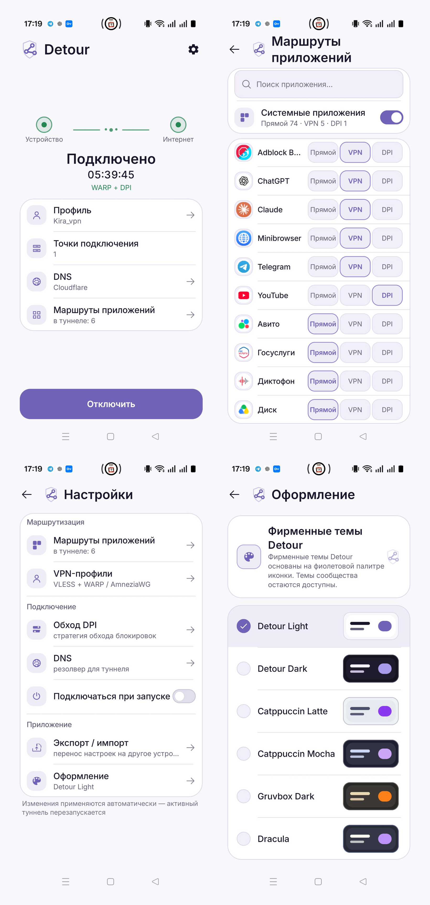

  <a href="README.md">English</a> · <strong>Русский</strong>

# Detour

### Маршрутизация приложений на Android

**Прямой · VPN · DPI**

Open-source клиент для Android, в котором можно выбрать, **как каждое приложение выходит в интернет**.
Одни приложения оставляйте напрямую, другие отправляйте через VPN, а ByeDPI включайте только там, где он нужен — всё внутри одного Android VPN-сервиса.

[**Скачать APK**](https://github.com/arttvad9r/detour/releases/latest) · [Быстрый старт](docs/getting-started.md) · [Возможности](docs/features.md)

  

## Один туннель. Три маршрута.

Detour назначает маршрут **каждому приложению отдельно**, а не заставляет весь телефон работать через один режим:

- **Прямой** — обычное подключение к интернету.
- **VPN** — VLESS Reality, HTTPS-подписки, WARP или AmneziaWG.
- **DPI** — нативный ByeDPI для выбранных приложений.

## Что умеет Detour

- Маршрутизация приложений **Прямой / VPN / DPI** и поиск по списку приложений.
- Профили VLESS Reality, HTTPS-подписки, WARP и AmneziaWG, включая поддерживаемый импорт Amnezia `vpn://`.
- Выбор серверов подписки, сортировка, проверка задержки и состояние узлов во время работы.
- Рекомендуемые и собственные стратегии ByeDPI плюс отдельный тест стратегий.
- DNS внутри туннеля: Cloudflare, Google, AdGuard, свой IP или HTTPS DoH.
- Плитка быстрых настроек, подключение при запуске, экспорт/импорт и несколько тем.

[Полное описание возможностей →](docs/features.md)

## Установка

Нужен **Android 10 / API 29+**. Текущий публичный релиз на GitHub содержит APK для `arm64-v8a`.

1. Скачайте APK из [GitHub Releases](https://github.com/arttvad9r/detour/releases/latest).
2. Добавьте или импортируйте VPN-профиль и назначьте маршруты приложениям.
3. Нажмите **«Подключить»** и разрешите Android создать VPN-подключение.

[Быстрый старт →](docs/getting-started.md)

> [!NOTE]
> Detour пока находится на стадии pre-release и распространяется вне Google Play. Проверяйте импортированные конфигурации и устанавливайте релизные APK только из этого репозитория.

## Открытый код и приватность

Аккаунт Detour не нужен. Приложение намеренно не отправляет аналитику проекта и автоматические crash-отчёты. Чувствительные данные профилей хранятся локально с шифрованием на основе Android Keystore.

Код Detour распространяется по [MIT](LICENSE). Встроенные компоненты сохраняют собственные лицензии — см. [third-party notices](THIRD_PARTY_NOTICES.md).

**Документация:** [Быстрый старт](docs/getting-started.md) · [Возможности](docs/features.md) · [Архитектура](docs/architecture.md) · [Тестирование](docs/testing.md) · [Приватность](PRIVACY.md) · [Безопасность](SECURITY.md) · [Участие в разработке](CONTRIBUTING.md)

<strong>Разработчикам и мейнтейнерам</strong>

Detour написан на Kotlin и Jetpack Compose. Android `VpnService` управляет туннелем, Mihomo используется как основной data plane, а нативный ByeDPI обслуживает DPI-маршрут.

[Архитектура](docs/architecture.md) · [Тестирование](docs/testing.md) · [Версии зависимостей](docs/pins.md) · [Релизы](docs/releasing.md)

